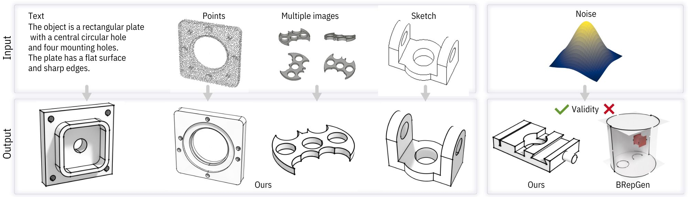

# HoLa-Brep: Holistic Latent Representation for B-rep Generation

[](https://arxiv_url)

<p align="center">
    
</p>

> This repository is for the HoLa-Brep project. Given a B-rep model which consists of surfaces, (half-) curves and vertices, we design a novel holistic latent representation (HL-Rep) to encode both the continuous geometric properties over all primitives and their discrete topological relationships into one holistic latent space. Compared with existing methods, primitives in the holistic latent space are intrinsically consistent, which enables a more accurate and expressive B-rep generation.

# About HoLa-Brep
HoLa-BRep contains a BRep VAE to encode a BRep model's topological and geometric information into a unified, holistic latent space and a latent diffusion model to generate holistic latent from multiple modalities. It can turn point clouds, single-view images, multi-view images, 2D sketches, or text prompts into solid BRep models. 


# Experiments
## Preparation⚙️
### 1. Envrionment 
#### 🌟**Run with Docker**(Recommended)🌟
There are two options for running the project using a Docker environment: 

1. **[Download]()** the Docker image directly

2. Or, you can manually build the Docker image:

```
docker build -t hola-brep .
```
> Some errors may occur when installing `pointnet2_ops_lib` if you choose to build the image manully. You may find a solution to these issues [here](./pointnet2_ops_lib/Possible_solution.md).

#### **Run locally**
We built the project based on **Linux** environment.

1. Install Linux dependencies:
```
apt update
apt install libgl-dev
apt install freeglut3 freeglut3-dev libosmesa6-dev libglu1-mesa-dev libglu1-mesa xserver-xorg-video-dummy
```

2. Create the environment with **Conda**:
```
conda env create -f environment.yml
conda activate HoLa-Brep
```

### 2. Checkpoints

Pre-trained checkpoints are available for **[download](https://somewhere)**. The file `ckpt.zip` should contain the following checkpoints:

| Checkpoint                            | Description                                                   |
| ------------------------------------- | ------------------------------------------------------------- |
| AE_ABC_1100k.ckpt                     | Autoencoder pre-trained on ABC dataset                        |
| AE_deepcad_1100k.ckpt                 | Autoencoder pre-trained on deepcad dataset                    |
| Diffusion_uncond_1100k.ckpt           | Pre-trained unconditional latent diffusion model              |
| Diffusion_mvr_sq30_800k.ckpt          | Pre-trained multi-image-conditioned latent diffusion model    |
| Diffusion_pc_sq30_1600k.ckpt          | Pre-trained point-conditioned latent diffusion model          |
| Diffusion_pc_sq30_noisy_2300k.ckpt    | Pre-trained point-conditioned latent diffusion model with noisy   |
| Diffusion_sketch_sq30_1500k.ckpt      | Pre-trained sketch-conditioned latent diffusion model         |
| Diffusion_svr_sq30_1500k.ckpt         | Pre-trained single-image-conditioned latent diffusion model   |
| Diffusion_txt_sq30_1000k.ckpt         | Pre-trained text-conditioned latent diffusion model           |

If you are running the project locally, please unzip the `ckpt.zip` file directly into the **root folder**. 

### 3. Data

You can download the data zip file `data.zip` from **[here]()**. It contains two folders: `organized_data`, `data_index` and `data_lfd_feat`.

+ `organized_data` variable contains the necessary data for conditioned generation, as well as the model itself.

```
organized_data
|-- 00000061
|   |-- data.npz
|   |-- img_feature_dinov2.npy
|   |-- imgs.npz
|   |-- normalized_shape.step
|   |-- pc.ply
|   |-- text.txt
|   `-- text_feat.npy
|...
```
+ `data_index` holds the index files of the models designated for the training, validation, and testing sets.
+ `data_lfd_feat` holds the light-field-distance features of every model in `organized_data`.

### 4. **Preparation check**
If you are running the project **locally**, the project folder structure should then appear as follows now:
```
HoLa-Brep
|-- ckpt
|   |-- AE_ABC_1100k.ckpt
|   |-- AE_deepcad_1100k.ckpt
|   |-- Diffusion_mvr_sq30_800k.ckpt
|   |-- Diffusion_pc_sq30_1600k.ckpt
|   |-- Diffusion_pc_sq30_noisy_2300k.ckpt
|   |-- Diffusion_sketch_sq30_1500k.ckpt
|   |-- Diffusion_svr_sq30_1500k.ckpt
|   |-- Diffusion_txt_sq30_1000k.ckpt
|   `-- Diffusion_uncond_1100k.ckpt
|-- data
|   |-- data_index
|   `-- organized_data
|-- diffusion
|-- eval
|-- ...
```

If you are using **Docker** for the project, further details will be provided in the next steps.


## Generation 🪄
### **Local**
To generate B-Rep models, you can use the following commands:

```
export TYPE="your_intended_method_of_generation"
bash scripts/generate_${TYPE}.sh
```
Please export `TYPE` using one of the following options::
+ `pc`, `txt`, `sketch`, `svr` or `mvr` for conditioned generation.
+ `unconditional` for unconditional generation.

### **Docker**🐋
If you are using **Docker**, you can generate models after `hola-brep` image is successfully built with this command:

```
export TYPE="your_intended_method_of_generation"
docker run --rm -it \
    --gpus all \
    --name hola-brep \
    --shm-size=24g \
    -p 8080:8080 \
    -v /path/to/your/host/output/folder:/HoLa-Brep/outputs \
    -v /path/to/your/host/data/folder:/HoLa-Brep/data \
    -v /path/to/your/host/checkpoint/folder:/HoLa-Brep/ckpt \
    # -v /path/to/dinov2:/root/.cache/torch/hub/checkpoints/dinov2_vitl14_reg4_pretrain.pth \
    hola-brep \
    bash scripts/generate_${TYPE}.sh
```
The available options for `TYPE` are the same as mentioned previously.

> If you encounter issues with loading DINOv2, please manually **[download](https://dl.fbaipublicfiles.com/dinov2/dinov2_vitl14/dinov2_vitl14_reg4_pretrain.pth)** the model and mount it to your Docker. 

For example:
```
docker run --rm -it \
    --gpus all \
    --name hola-brep \
    -p 8080:8080 \
    -v /path/to/your/host/output/folder:/HoLa-Brep/outputs \
    -v /path/to/your/host/data/folder:/HoLa-Brep/data \
    -v /path/to/your/host/checkpoint/folder:/HoLa-Brep/ckpt \
    hola-brep \
    bash scripts/generate_uncond.sh
```


## Post-Process🪚
After generation, the output is converted into a watertight CAD model through post-processing:
```
export TYPE="generation_type"
bash script/postprocess.sh
```
The available options for `TYPE` are the same as mentioned previously.

You can find model folders containing a `.step` file in the `outputs/${TYPE}_post` folder.

# Inference🖨️

You can try to inference **[here](https://huggingface.co/spaces/YuXingyao/HoLa-BRep)**

# Evaluation🧮
### 1. Unconditional
To evaluate unconditional results:
```
bash eval/eval_uncond.sh
```

### 2. Conditioned
To evaluate conditioned results:

1. Export the condition name
```
export TYPE="generation_type"
```
`TYPE` can be `pc`, `txt`, `sketch`, `svr` or `mvr` as stated previously.

2. Execute the script
```
bash eval/eval_cond.sh
```
You can find the evaluation results in the `outputs` folder as well.

### 3. LFD

1. Compile the files for light fild distance
```
cd eval/lfd/evaluation_scripts/load_data
bash do_all.sh
cd ../..
git clone https://github.com/kacperkan/light-field-distance
cd light-field-distance
bash compile.sh
python setup.py install
cd ..
```

2. To Calculate LFD, we need a virtual displayer to render objects:
```
X -config evaluation_scripts/compute_lfd_feat/dummy-1920x1080.conf
```
3. To have access to the virtual displayer we have to indicate where it is in a **new terminal**:
```
export DISPLAY=:0
```

4. Return to the root directory and specify the generation `TYPE` you want to evaluate:
```
cd ../..
export TYPE=""
bash eval/eval_lfd.sh
```

You can check the visualized LFD result in the `outputs` folder.


# Citation📃
If you find our project useful, hope you can star our repo and cite our paper as follows:
```
@article{HolaBRep25,
    title={HoLa: B-Rep Generation using a Holistic Latent Representation},
    author={Yilin Liu and Duoteng Xu and Xinyao Yu and Xiang Xu and Daniel Cohen-Or and Hao Zhang andHuang},
    journal={ACM Transactions on Graphics (Proceedings of SIGGRAPH)},
    volume={44},
    number={4},
    year={2025},
}
```
